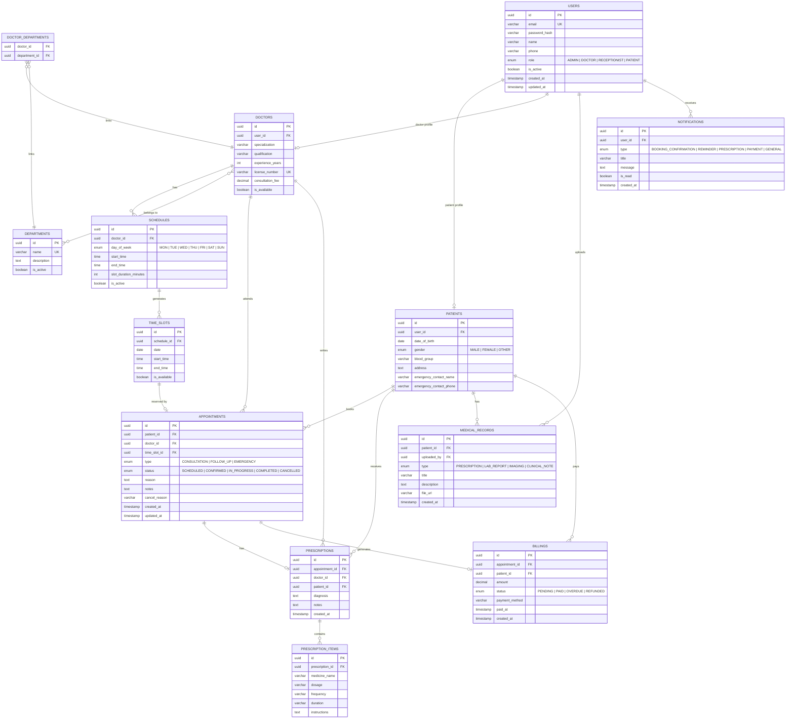

# ER Diagram — HealthSync

## Database: PostgreSQL (Relational Data)



---

## Database: MongoDB (Document Store)

Used for flexible, high-volume, or semi-structured data.

### Collection: `audit_logs`

```json
{
  "_id": "ObjectId",
  "userId": "uuid (ref: users)",
  "action": "CREATE | UPDATE | DELETE | LOGIN | LOGOUT",
  "entity": "appointment | prescription | user | billing",
  "entityId": "uuid",
  "changes": {
    "before": { },
    "after": { }
  },
  "ipAddress": "192.168.1.1",
  "userAgent": "Mozilla/5.0...",
  "timestamp": "ISODate"
}
```

### Collection: `chat_messages` (Doctor–Patient communication)

```json
{
  "_id": "ObjectId",
  "appointmentId": "uuid",
  "senderId": "uuid",
  "receiverId": "uuid",
  "message": "string",
  "attachments": ["url1", "url2"],
  "isRead": false,
  "sentAt": "ISODate"
}
```

---

## Cache: Redis

| Key Pattern | Value | TTL | Purpose |
|---|---|---|---|
| `slots:{doctorId}:{date}` | JSON array of available slots | 5 min | Avoid repeated slot computation |
| `analytics:{range}` | Dashboard metrics JSON | 15 min | Cache expensive aggregation queries |
| `session:{userId}` | Session metadata | 24 hr | Active session tracking |
| `rate:{ip}` | Request count | 1 min | Rate limiting |

---

## Table Summary

| Table | Rows (Est.) | Key Relationships |
|---|---|---|
| `users` | All users | Parent of patients, doctors |
| `patients` | 1:1 with user | Owns appointments, records, billings |
| `doctors` | 1:1 with user | Owns schedules, appointments, prescriptions |
| `departments` | ~10-20 | Many-to-many with doctors |
| `schedules` | Per doctor per day | Generates time slots |
| `time_slots` | High volume | Reserved by appointments |
| `appointments` | Core entity | Links patient ↔ doctor ↔ slot |
| `prescriptions` | Per appointment | Contains prescription items |
| `prescription_items` | Per prescription | Medicine details |
| `medical_records` | Per patient | Documents and reports |
| `billings` | Per appointment | Payment tracking |
| `notifications` | Per user | Alert delivery |
