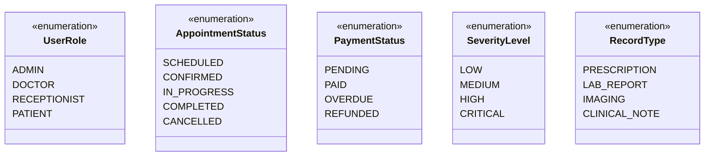

# Class Diagram — HealthSync

## Major Classes & Relationships

```mermaid
classDiagram
    direction TB

    %% ══════════════════════════════════════════
    %% DOMAIN ENTITIES
    %% ══════════════════════════════════════════

    class User {
        <<abstract>>
        #id: string
        #email: string
        #passwordHash: string
        #name: string
        #phone: string
        #role: UserRole
        #createdAt: Date
        +login(email, password): Token
        +updateProfile(data): void
        +getRole(): UserRole*
        +hasPermission(action): boolean*
    }

    class Admin {
        -department: string
        +manageUsers(): void
        +viewAnalytics(): AnalyticsDTO
        +getRole(): UserRole
        +hasPermission(action): boolean
    }

    class Doctor {
        -specialization: string
        -qualification: string
        -experienceYears: number
        -licenseNumber: string
        -consultationFee: number
        +manageSchedule(schedule): void
        +startConsultation(appointmentId): void
        +writePrescription(data): Prescription
        +getRole(): UserRole
        +hasPermission(action): boolean
    }

    class Receptionist {
        -shift: string
        +registerPatient(data): Patient
        +bookWalkIn(data): Appointment
        +getRole(): UserRole
        +hasPermission(action): boolean
    }

    class Patient {
        -dateOfBirth: Date
        -gender: Gender
        -bloodGroup: string
        -address: string
        -emergencyContact: string
        +bookAppointment(data): Appointment
        +viewMedicalHistory(): MedicalRecord[]
        +getRole(): UserRole
        +hasPermission(action): boolean
    }

    User <|-- Admin
    User <|-- Doctor
    User <|-- Receptionist
    User <|-- Patient

    %% ══════════════════════════════════════════
    %% APPOINTMENT HIERARCHY
    %% ══════════════════════════════════════════

    class Appointment {
        <<abstract>>
        #id: string
        #patientId: string
        #doctorId: string
        #timeSlotId: string
        #reason: string
        #notes: string
        #status: AppointmentStatus
        #state: IAppointmentState
        #createdAt: Date
        +confirm(): void
        +start(): void
        +complete(): void
        +cancel(reason): void
        +getType(): string*
        +calculateFee(): number*
        +setState(state): void
    }

    class Consultation {
        -isFirstVisit: boolean
        +getType(): string
        +calculateFee(): number
    }

    class FollowUp {
        -previousAppointmentId: string
        -followUpReason: string
        +getType(): string
        +calculateFee(): number
    }

    class Emergency {
        -severity: SeverityLevel
        -triageNotes: string
        +getType(): string
        +calculateFee(): number
    }

    Appointment <|-- Consultation
    Appointment <|-- FollowUp
    Appointment <|-- Emergency

    %% ══════════════════════════════════════════
    %% STATE PATTERN (Appointment Lifecycle)
    %% ══════════════════════════════════════════

    class IAppointmentState {
        <<interface>>
        +confirm(appointment): void
        +start(appointment): void
        +complete(appointment): void
        +cancel(appointment, reason): void
        +getStatus(): AppointmentStatus
    }

    class ScheduledState {
        +confirm(appointment): void
        +cancel(appointment, reason): void
        +getStatus(): AppointmentStatus
    }

    class ConfirmedState {
        +start(appointment): void
        +cancel(appointment, reason): void
        +getStatus(): AppointmentStatus
    }

    class InProgressState {
        +complete(appointment): void
        +getStatus(): AppointmentStatus
    }

    class CompletedState {
        +getStatus(): AppointmentStatus
    }

    class CancelledState {
        -cancelReason: string
        +getStatus(): AppointmentStatus
    }

    IAppointmentState <|.. ScheduledState
    IAppointmentState <|.. ConfirmedState
    IAppointmentState <|.. InProgressState
    IAppointmentState <|.. CompletedState
    IAppointmentState <|.. CancelledState
    Appointment --> IAppointmentState : currentState

    %% ══════════════════════════════════════════
    %% SCHEDULING
    %% ══════════════════════════════════════════

    class Schedule {
        -id: string
        -doctorId: string
        -dayOfWeek: DayOfWeek
        -startTime: string
        -endTime: string
        -slotDuration: number
        +generateSlots(date): TimeSlot[]
        +isAvailable(day): boolean
    }

    class TimeSlot {
        -id: string
        -scheduleId: string
        -date: Date
        -startTime: string
        -endTime: string
        -isAvailable: boolean
        +reserve(): void
        +release(): void
    }

    Doctor "1" --> "*" Schedule : has
    Schedule "1" --> "*" TimeSlot : generates
    Appointment "1" --> "1" TimeSlot : occupies

    %% ══════════════════════════════════════════
    %% PRESCRIPTION (Builder Pattern)
    %% ══════════════════════════════════════════

    class Prescription {
        -id: string
        -appointmentId: string
        -doctorId: string
        -patientId: string
        -diagnosis: string
        -notes: string
        -items: PrescriptionItem[]
        -createdAt: Date
        +addItem(item): void
        +print(): string
    }

    class PrescriptionItem {
        -id: string
        -medicineName: string
        -dosage: string
        -frequency: string
        -duration: string
        -instructions: string
    }

    class PrescriptionBuilder {
        -prescription: Prescription
        +setPatient(patientId): PrescriptionBuilder
        +setDoctor(doctorId): PrescriptionBuilder
        +setDiagnosis(text): PrescriptionBuilder
        +addMedicine(name, dosage, freq, dur): PrescriptionBuilder
        +setNotes(notes): PrescriptionBuilder
        +build(): Prescription
    }

    Prescription "1" --> "*" PrescriptionItem : contains
    PrescriptionBuilder ..> Prescription : builds
    Appointment "1" --> "0..1" Prescription : has

    %% ══════════════════════════════════════════
    %% MEDICAL RECORDS
    %% ══════════════════════════════════════════

    class MedicalRecord {
        -id: string
        -patientId: string
        -type: RecordType
        -title: string
        -description: string
        -fileUrl: string
        -createdAt: Date
    }

    Patient "1" --> "*" MedicalRecord : has

    %% ══════════════════════════════════════════
    %% BILLING
    %% ══════════════════════════════════════════

    class Billing {
        -id: string
        -appointmentId: string
        -patientId: string
        -amount: number
        -status: PaymentStatus
        -paymentMethod: string
        -paidAt: Date
        -createdAt: Date
        +markPaid(method): void
        +generateReceipt(): Receipt
    }

    Appointment "1" --> "0..1" Billing : generates

    %% ══════════════════════════════════════════
    %% STRATEGY PATTERN (Notifications)
    %% ══════════════════════════════════════════

    class INotificationStrategy {
        <<interface>>
        +send(recipient, message): Promise~void~
    }

    class EmailNotification {
        +send(recipient, message): Promise~void~
    }

    class SMSNotification {
        +send(recipient, message): Promise~void~
    }

    class PushNotification {
        +send(recipient, message): Promise~void~
    }

    class NotificationService {
        -strategies: INotificationStrategy[]
        +notify(userId, event, data): void
        +addStrategy(strategy): void
    }

    INotificationStrategy <|.. EmailNotification
    INotificationStrategy <|.. SMSNotification
    INotificationStrategy <|.. PushNotification
    NotificationService --> INotificationStrategy : uses

    class Notification {
        -id: string
        -userId: string
        -type: NotificationType
        -title: string
        -message: string
        -isRead: boolean
        -createdAt: Date
        +markRead(): void
    }

    %% ══════════════════════════════════════════
    %% FACTORY PATTERN
    %% ══════════════════════════════════════════

    class UserFactory {
        +create(role, data): User$
    }

    class AppointmentFactory {
        +create(type, data): Appointment$
    }

    UserFactory ..> User : creates
    AppointmentFactory ..> Appointment : creates

    %% ══════════════════════════════════════════
    %% REPOSITORY INTERFACES
    %% ══════════════════════════════════════════

    class IRepository~T~ {
        <<interface>>
        +findById(id): Promise~T~
        +findAll(filter): Promise~T[]~
        +create(entity): Promise~T~
        +update(id, data): Promise~T~
        +delete(id): Promise~void~
    }

    class IAppointmentRepository {
        <<interface>>
        +findByDoctor(doctorId, date): Promise~Appointment[]~
        +findByPatient(patientId): Promise~Appointment[]~
        +checkSlotAvailability(slotId): Promise~boolean~
    }

    IRepository <|-- IAppointmentRepository

    %% ══════════════════════════════════════════
    %% KEY ASSOCIATIONS
    %% ══════════════════════════════════════════

    Doctor "1" --> "*" Appointment : attends
    Patient "1" --> "*" Appointment : books
    Doctor "1" --> "*" Prescription : writes
    Patient "1" --> "*" Billing : pays
    User "1" --> "*" Notification : receives
```

---

## Enums

```mermaid
classDiagram
    class UserRole {
        <<enumeration>>
        ADMIN
        DOCTOR
        RECEPTIONIST
        PATIENT
    }

    class AppointmentStatus {
        <<enumeration>>
        SCHEDULED
        CONFIRMED
        IN_PROGRESS
        COMPLETED
        CANCELLED
    }

    class PaymentStatus {
        <<enumeration>>
        PENDING
        PAID
        OVERDUE
        REFUNDED
    }

    class SeverityLevel {
        <<enumeration>>
        LOW
        MEDIUM
        HIGH
        CRITICAL
    }

    class RecordType {
        <<enumeration>>
        PRESCRIPTION
        LAB_REPORT
        IMAGING
        CLINICAL_NOTE
    }
```
