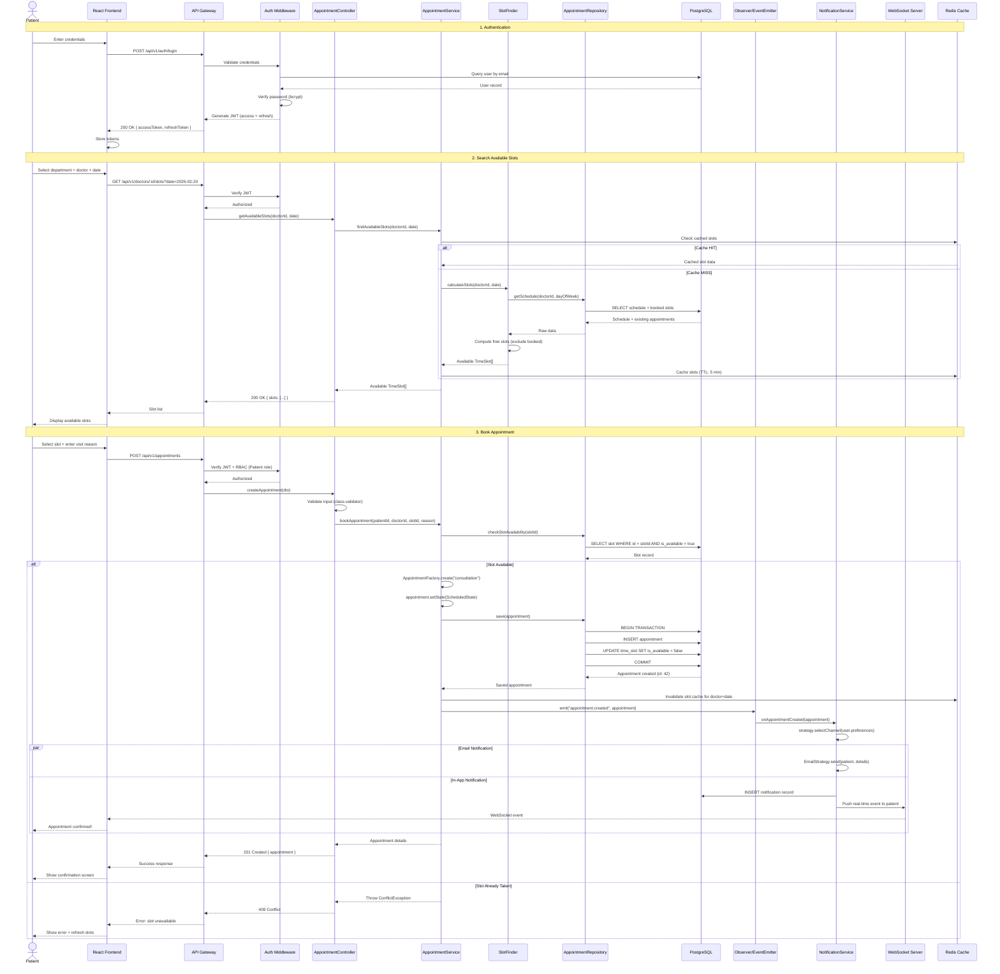
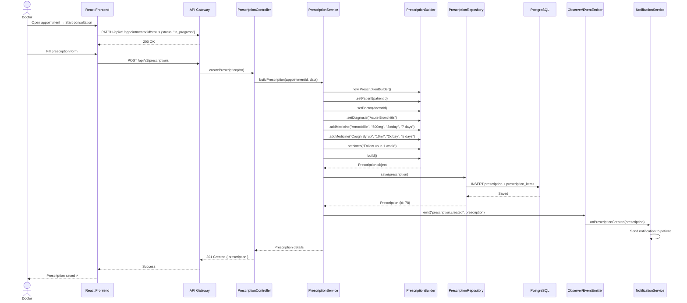
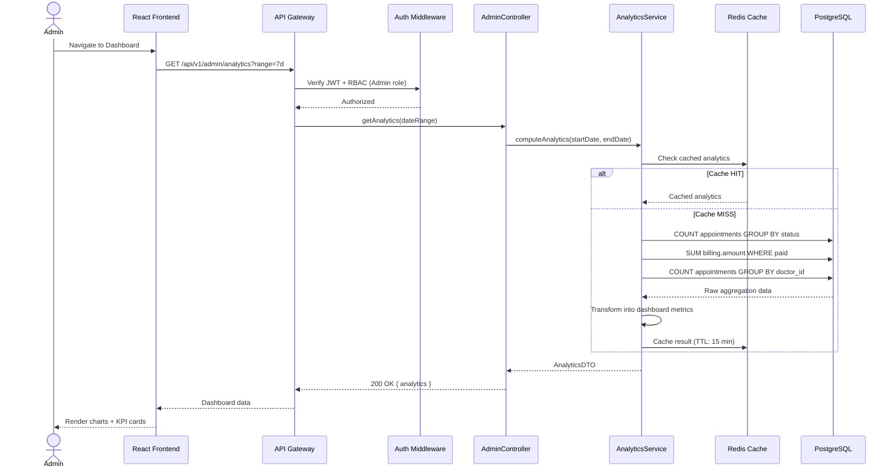

# Sequence Diagram — HealthSync

## Main Flow: Patient Books an Appointment (End-to-End)

This sequence covers the complete flow from patient login → slot search → appointment booking → notification delivery.

---

## Secondary Flow: Doctor Writes a Prescription

---

## Tertiary Flow: Admin Views Analytics

