# Use Case Diagram — HealthSync

## Actors

| Actor | Description |
|---|---|
| **Patient** | Books appointments, views prescriptions, pays bills |
| **Doctor** | Manages schedule, conducts consultations, writes prescriptions |
| **Receptionist** | Registers patients, manages walk-in bookings, handles billing |
| **Admin** | Manages users, departments, views analytics, monitors audit logs |
| **System** | Sends automated notifications, generates invoices, enforces slot rules |

---

## Use Case Diagram

```mermaid
flowchart LR
    Patient((Patient))
    Doctor(( Doctor))
    Receptionist(( Receptionist))
    Admin(( Admin))
    System((System))

    subgraph Authentication
        UC1[Register Account]
        UC2[Login / Logout]
        UC3[Reset Password]
    end

    subgraph Patient_Management["Patient Management"]
        UC4[Create Patient Profile]
        UC5[Update Patient Info]
        UC6[View Medical History]
    end

    subgraph Appointment_Management["Appointment Management"]
        UC7[Search Available Slots]
        UC8[Book Appointment]
        UC9[Reschedule Appointment]
        UC10[Cancel Appointment]
        UC11[View Appointment Status]
    end

    subgraph Doctor_Operations["Doctor Operations"]
        UC12[Manage Weekly Schedule]
        UC13[View Today's Appointments]
        UC14[Start Consultation]
        UC15[Write Prescription]
        UC16[View Patient Records]
    end

    subgraph Billing["Billing & Payments"]
        UC17[Generate Invoice]
        UC18[Process Payment]
        UC19[View Payment History]
        UC20[Download Receipt]
    end

    subgraph Notifications["Notifications"]
        UC21[Send Booking Confirmation]
        UC22[Send Appointment Reminder]
        UC23[Send Prescription Alert]
    end

    subgraph Admin_Operations["Admin Operations"]
        UC24[Manage Users]
        UC25[Manage Departments]
        UC26[View Analytics Dashboard]
        UC27[View Audit Logs]
    end

    %% Patient connections
    Patient --> UC1
    Patient --> UC2
    Patient --> UC3
    Patient --> UC7
    Patient --> UC8
    Patient --> UC9
    Patient --> UC10
    Patient --> UC11
    Patient --> UC6
    Patient --> UC18
    Patient --> UC19
    Patient --> UC20

    %% Doctor connections
    Doctor --> UC2
    Doctor --> UC12
    Doctor --> UC13
    Doctor --> UC14
    Doctor --> UC15
    Doctor --> UC16

    %% Receptionist connections
    Receptionist --> UC2
    Receptionist --> UC4
    Receptionist --> UC5
    Receptionist --> UC7
    Receptionist --> UC8
    Receptionist --> UC9
    Receptionist --> UC10
    Receptionist --> UC17
    Receptionist --> UC18

    %% Admin connections
    Admin --> UC2
    Admin --> UC24
    Admin --> UC25
    Admin --> UC26
    Admin --> UC27

    %% System connections
    System --> UC21
    System --> UC22
    System --> UC23
    System --> UC17
```

---

## Use Case Descriptions

### UC8 — Book Appointment (Primary Flow)

| Field | Detail |
|---|---|
| **Actor** | Patient / Receptionist |
| **Precondition** | User is logged in; Doctor's schedule has available slots |
| **Main Flow** | 1. Select department & doctor → 2. Pick available date & slot → 3. Provide visit reason → 4. Confirm booking → 5. System reserves slot & sends confirmation |
| **Postcondition** | Appointment created with status `Scheduled`; Notification sent |
| **Alternate Flow** | Slot no longer available → show error, refresh slots |

### UC15 — Write Prescription

| Field | Detail |
|---|---|
| **Actor** | Doctor |
| **Precondition** | Consultation is in progress (appointment status = `In Progress`) |
| **Main Flow** | 1. View patient history → 2. Add diagnosis → 3. Add medicines (name, dosage, frequency, duration) → 4. Add notes → 5. Save prescription |
| **Postcondition** | Prescription linked to appointment; Patient receives notification |

### UC26 — View Analytics Dashboard

| Field | Detail |
|---|---|
| **Actor** | Admin |
| **Precondition** | Admin is logged in |
| **Main Flow** | 1. View today's appointment count → 2. View revenue summary → 3. View doctor utilization rates → 4. Filter by date range / department |
| **Postcondition** | Dashboard data displayed with charts |
